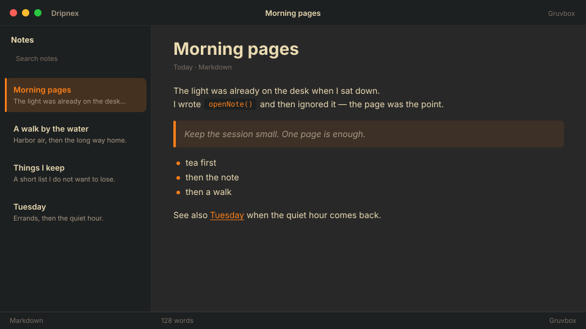

# Gruvbox

Retro groove. Warm browns and a loud orange — the other Vim default.



```
dripnex/theme-gruvbox
```

## Palette

The chips live in [palette.html](palette.html) — open it in a browser. GitHub won’t paint HTML swatches here, so the hex list is below.

| Name | Token | Color | What it’s for |
| --- | --- | --- | --- |
| Base | `--bg-base` | `#282828` | Window background |
| Surface | `--bg-surface` | `#1d2021` | Sidebar and chrome |
| Elevated | `--bg-elevated` | `#3c3836` | Raised panels |
| Text | `--text-primary` | `#ebdbb2` | Headings and body |
| Muted | `--text-muted` | `#a89984` | Secondary copy |
| Accent | `--accent` | `#fe8019` | Selection and links |
| Active | `--status-active` | `#fe8019` | Active status |
| Dropped | `--status-dropped` | `#fb4934` | Dropped status |

Pick it when you want warm retro contrast, not a sterile dashboard.
